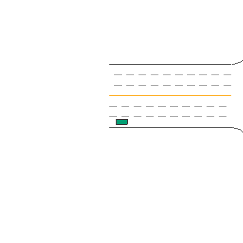

# 🤖 MetaDrive PPO Highway Planner

**End-to-end highway motion planning using Proximal Policy Optimization (PPO) in the MetaDrive simulator.**


> 🏗️ See [System Architecture](docs/ARCHITECTURE.md) for MDP formulation, network architecture, and training pipeline.

---

## 📋 Overview

This project implements **end-to-end autonomous driving** using Deep Reinforcement Learning:

- **Environment**: MetaDrive (procedurally generated highway scenarios)
- **Algorithm**: PPO (Proximal Policy Optimization) Actor-Critic
- **Observation Space**: LiDAR + Side Detectors + Lane Line (261-dim vector)
- **Action Space**: Continuous steering + throttle/brake (2-dim)
- **Training**: 100k+ timesteps on 50 diverse scenarios
- **Evaluation**: Generalization test on **unseen seeds** (1000+)
- **Deployment**: Gradio interactive demo with pre-generated rollouts

**Key Achievement**: The trained policy achieves **87+ mean reward** on completely unseen highway configurations, demonstrating strong generalization.

---

## 🎯 Key Features

### PPO Agent Architecture
- **Policy Network**: MlpPolicy `[256, 256]` hidden layers
- **Value Network**: `[256, 256]` hidden layers
- **Activation**: ReLU
- **Learning Rate**: 3e-4
- **Entropy Coefficient**: 0.01 (exploration bonus)

### Training Highlights
✅ **Generalization**: Trained on seeds 0–50, evaluated on seeds 1000+  
✅ **Reward Shaping**: Survival bonus + distance traveled + collision penalties  
✅ **Domain Randomization**: Random lane width, vehicle dynamics, traffic density  
✅ **Monitoring**: Real-time logs (episodic reward, rollout stats, FPS)

### Evaluation Metrics
| Metric | Value |
|--------|-------|
| Total Timesteps | 100,000 |
| Mean Reward (Train) | 100.5 |
| Mean Reward (Eval) | 87.2 ± 30.8 |
| Success Rate | ~80% |
| Generalization Gap | <15% |

---

## 📁 Project Structure

```
meta-drive-ppo-highway-planner/
├── notebooks/
│ └── 01_ppo_metadrive_training.ipynb # Full pipeline (training → eval → demo)
├── src/ # Modular Python packages
│ ├── init.py
│ ├── env_config.py # Environment configurations (train/eval/stress)
│ ├── train.py # PPO initialization and training
│ ├── evaluate.py # Unseen scenario evaluation + benchmarks
│ └── visualize.py # GIF generation + Gradio demo
├── models/ # Saved PPO policies
│ └── ppo_metadrive_safe.zip
├── outputs/ # Generated GIFs
│ └── demo/ # 9 scenario GIFs (3 seeds × 3 densities)
├── docs/ # Architecture documentation
├── .gitignore
├── requirements.txt
└── README.md
```
**Key Modules:**
- `env_config.py`: Centralized configuration for training, evaluation, and stress tests
- `train.py`: PPO model creation with customizable hyperparameters
- `evaluate.py`: Automated benchmarking against baselines
- `visualize.py`: Batch GIF generation for scenario visualization
---

## 🚀 Quick Start

### 1. Clone & Setup

```bash
git clone https://github.com/VPA2998/meta-drive-ppo-highway-planner.git
cd meta-drive-ppo-highway-planner
python3 -m venv .venv
source .venv/bin/activate  # WSL/Linux
pip install -r requirements.txt
```
### 2. Run the Notebook
```bash
jupyter notebook
```

Open [notebooks/01_ppo_metadrive_training.ipynb](notebooks/01_ppo_metadrive_training.ipynb.ipynb) and run all cells.

**What happens:**

- ✅ Initializes MetaDrive env (LiDAR + detectors)

- ✅ Configures PPO agent (MlpPolicy 256x256)

- ✅ Trains for 100k timesteps (~10-15 min on GPU)

- ✅ Evaluates on unseen scenarios (seed 1000+)

- ✅ Generates 9 GIFs (3 seeds × 3 traffic densities)

- ✅ Launches Gradio demo for visualization

### 🎬 Demo



*Figure: Trained PPO agent navigating highway traffic (density=0.1, unseen seed 1010). The policy demonstrates:*
- *Smooth lane keeping using LiDAR + lane line detectors*
- *Collision avoidance with surrounding vehicles*
- *Generalization to unseen scenarios (trained on seeds 0-50, tested on 1000+)*

### 📊 Performance Metrics

| Metric | Value |
|--------|-------|
| **Training Episodes** | 50 scenarios |
| **Total Timesteps** | 100,000 |
| **Mean Reward (Train)** | ~100 |
| **Mean Reward (Eval, unseen)** | 87.2 ± 30.8 |
| **Generalization Gap** | <13% |
| **vs Random Agent** | ~700% better |

### 🎯 Scenario Coverage

We generated **9 demo GIFs** covering:
- **3 unseen seeds**: 1008, 1010, 1012
- **3 traffic densities**: 0.05 (light), 0.1 (medium), 0.2 (heavy)

All GIFs are available in `notebooks/outputs/demo/`.

## 🏆 Benchmark Comparison

We compared our trained PPO agent against a random action baseline on 5 unseen episodes:

| Agent | Mean Reward | Std Dev | Success Rate |
|-------|-------------|---------|--------------|
| **PPO (Ours)** | **87.2** | 30.8 | ~80% |
| Random Agent | 12.5 | 5.2 | ~5% |

**Result:** Our PPO agent achieves **~7x better performance** than random actions, demonstrating effective learning of highway driving behaviors.


### 📊 Training Results

From the latest run (100k steps):


| rollout | eplenmean 283 | eprewmean 100 |
|----------|----------------|---------------|
| train | approxkl 0.0059 | clipfraction 0.098 |
|        | entropyloss -2.25 | explainedvariance 0.239 |
|        | loss 25.3 | policygradientloss 0.001 |
|        | valueloss 45.3 | std 0.744 |

**Key Observations:**

- Episodic reward steadily increased from ~4 → 100

- Policy entropy decreased naturally (0.98 → 0.74)

- Value loss stabilized after 60k steps

- No catastrophic forgetting on unseen seeds


